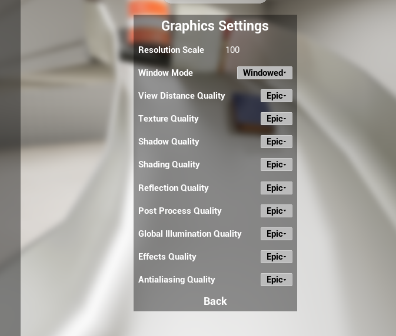

# EmulatorViewer (WIP)
 
This is an application I developed in Unreal Engine 5.1 as a proof of concept for a physics based emulation or HMI software to interact with a wide range of material handling systems.
The plan is for this app is to be able to serve as a simulated environment to enable automated and repeatable testing scenarios by creating models that represent material handling system layouts and devices in the field that can provide mock inputs/outputs to any controllers, as well as collection and display of any metrics/statistics relevant to the system. In addition to the emulator functionality, it could also serve in an HMI/SCADA role presenting fault and statistics data to the user and allowing supervisory control of the system to the user.

The project is very early in development and still very much in the prototyping stage.

Currently implemented:
 - Physics-based conveyor belts that correctly simulate friction locomotion of items on a conveyor belt. Straight (Level, incline, decline) and 90 degree turns available.
 - Customizable item spawner that allows the user to spawn new items onto a conveyor with a variety of settings to control the spawn rate and size of items, as well as introducing randomness to these factors.
 - "Interact Mode" which allows users to "grab" any physics item in the scene and manipulate it for finer control of placement or remove it from the system. 
 - Free movement of the camera within a scene with the ability to rotate, zoom, and snap-to focus on selected objects.

## Main Menu

### Settings

## Controls

#### Keyboard:
- W/Up: Move forward
- S/Down: Move backwards
- A/Left: Move left
- D/Right: Move right
- Q: Move down vertically
- E: Move up vertically
- F: Move focal point to the currently selected object.
- END: Set focal point back down to floor level.
- ESC: Pauses the sim and opens pause menu.
- P: Pauses the sim and opens pause menu.
- SPACE: If in Interact Mode, grabs a physics object under the cursor. Press again to release object.
- 1: Sets Observe Mode. Default control mode, no interaction allowed.
- 2: Sets Interact Mode. Allows interating with physics objects.
- 3: Sets Build Mode. Allows the creation, modification, and deletion of conveyors, chutes, and other devices. (Still WIP, not implemented).

#### Mouse:
- Middle mouse hold & drag: Rotates camera aroud focal point.
- Left mouse button: Selects an object as the current selection.
- Right mouse button: Opens a details popup window for objects that implement it.
- Mouse wheel scroll: If in Observe Mode, zoom camera closer/further from focal point.
                    If in Interact Mode and holding an object, moves object further or closer to you.
					
#### Pause Menu:
- Resume: Closes menu and unpauses the sim.
- Settings: Opens a menu allowing you to change graphics settings.
- Quit: To Main Menu exits back to the main menu.
      To Desktop exits the program.
	  
#### Useful console commands: 
Press the backtick/tilda `/~ key at any time to open the console.
- "stat fps" Show current fps and render time in ms.
- "t.maxfps <number>" Set a maximum fps (Use 999 to see unlocked framerate. It will be set at 120 by default.)
- "r.setres <XPixels>x<YPixels>" Set the window resolution. (If Window Mode is set to anything other than Fullscreen in the settings menu.)